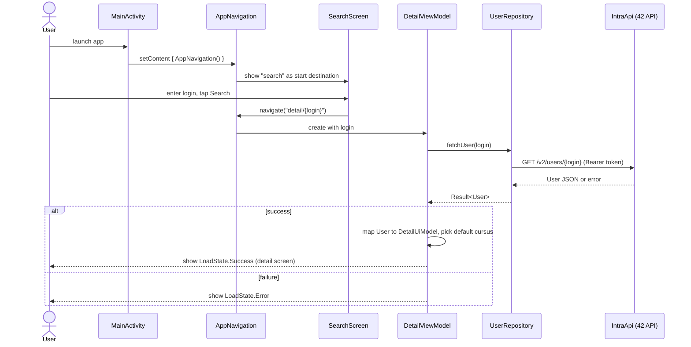

# Swifty Companion

<!-- Add image or use below -->

<!--  -->

<div align="center">
  <!--  -->
  <br />
  <em>  
    This project was created as part of the 42 curriculum by <a href="https://github.com/ysengoku">yusengok</a>.
  </em>
  <br /><br /><br />
  
  
  
</div>

## Table of Contents

<details>
<summary>Click to Show / Hide</summary>

- [About](#about)
- [Objectives](#objectives)
- [Features](#features)
- [Architecture](#architecture)
  - [Request Flow](#request-flow)
- [Project Structure](#project-structure)
- [Tech Stack](#tech-stack)
- [Technical Restrictions](#technical-restrictions)
- [Getting Started](#getting-started)
  - [Prerequisites](#prerequisites)
  - [Installation](#installation)
  - [Usage](#usage)
- [Development](#development)
  - [Workflow](#workflow)
  - [Linting & Formatting](#linting--formatting)
  - [Testing](#testing)
  - [Debugging](#debugging)
- [Notes](#notes)
- [Resources](#resources)
- [AI Usage](#ai-usage)
- [Authors](#authors)
- [License](#license)

</details>

## About

Swifty Companion is an Android app built for the 42 curriculum. Given a 42 login, it looks up that student through the 42 Intra API and displays their profile information.

## Objectives

This project served as an introduction to mobile app development, from picking up the language and tooling to integrating with an external, authenticated API.

## Features

- Search for a 42 student by login and view their profile: picture, name, campus, and title, alongside their level,completed projects and skills
- Switch between the student's cursus to browse the skills and projects for each one
- OAuth2 authentication handled transparently, including automatic token refresh

## Architecture

This follows the standard Android-recommended **MVVM** architecture, with a **Repository** layer abstracting the data source from the ViewModel.

- **Model** (data layer) provides user data to the ViewModel, isolated from network details:
  - **Repository** is the single entry point to the data layer. It hides the network call behind a plain suspend function and turns the outcome into a `Result`.
  - **API (IntraApi / Retrofit)** talks to the 42 Intra API over HTTP, with the OAuth2 token attached, and transparently refreshed, by an interceptor.
- **View** (UI layer) renders the current state and forwards user actions to the ViewModel. It holds no business logic.
- **ViewModel** owns the screen's state, decides when to fetch data, and derives view-specific data (e.g. which cursus's projects to show) from what it already holds, instead of storing it separately.

### Request Flow

The diagram below traces a single user flow, from launching the app to viewing a 42 student's profile, through the layers involved (UI, ViewModel, Repository, API).



**Data fetching ownership:**

The detail screen receives only a login as its navigation argument and fetches the user itself, rather than the search screen fetching first and passing the result along.   
This keeps the two screens independent: the detail screen works the same way regardless of how it's opened, and there's only one place holding the user's data.   

>[!NOTE] The trade-off is that a login that doesn't exist isn't caught until the detail screen is entered, so it shows a loading state briefly before the error, rather than failing on the search screen itself.

**State management:**

`DetailUiState` holds only `LoadState` (Loading / Success / Error) and `selectedCursusId`. It does not separately store "the selected cursus" or "that cursus's projects": both are derived from the loaded `DetailUiModel` and `selectedCursusId` whenever they're needed. Keeping derived data out of the state avoids ever having two representations of the same information that could drift out of sync.

**Error handling:**

`UserRepository.fetchUser` wraps the API call in a `Result<User>`, so the ViewModel can express success and failure without exceptions crossing that boundary.   `CancellationException` is deliberately rethrown rather than wrapped: coroutines use it internally to signal cancellation, and swallowing it here would stop a cancelled coroutine from actually completing its cancellation.

## Project Structure

```bash
.
├── app
│   ├── build.gradle.kts  # app module dependencies and build config
│   └── src
│       ├── main
│       │   ├── AndroidManifest.xml  # app configuration
│       │   ├── java
│       │   │   └── dev
│       │   │       └── ysengoku
│       │   │           └── swiftycompanion
│       │   │               ├── MainActivity.kt           # app entry point
│       │   │               ├── data
│       │   │               │   ├── ApiConfig.kt          # API base URL and related config
│       │   │               │   ├── IntraApi.kt           # Retrofit client and auth interceptor
│       │   │               │   ├── model
│       │   │               │   │   ├── TokenResponse.kt  # OAuth2 token response model
│       │   │               │   │   └── User.kt           # 42 API user response model
│       │   │               │   ├── repository
│       │   │               │   │   └── UserRepository.kt # repository for fetching a user
│       │   │               │   └── TokenManager.kt       # fetches, caches and refreshes the OAuth2 token
│       │   │               └── ui
│       │   │                   ├── navigation
│       │   │                   │   └── AppNavigation.kt     # screen navigation setup
│       │   │                   ├── search
│       │   │                   │   └── SearchScreen.kt      # search screen UI
│       │   │                   ├── detail
│       │   │                   │   ├── DetailScreen.kt      # detail screen UI
│       │   │                   │   ├── UserProfileScreen.kt # composable rendering the profile, used in DetailScreen
│       │   │                   │   ├── DetailUiModel.kt     # UI data model for the detail screen
│       │   │                   │   └── DetailViewModel.kt   # detail screen state management
│       │   │                   ├── component # reusable composables
│       │   │                   └── theme     # Material 3 theme definitions
│       │   │
│       │   └── res                   # images, fonts and other resources
│       └── test                      # unit tests
├── gradle
│   ├── gradle-daemon-jvm.properties  # required JDK version for Gradle
│   ├── libs.versions.toml            # dependency version catalog
│   └── wrapper
│       ├── gradle-wrapper.jar        # Gradle Wrapper binary
│       └── gradle-wrapper.properties # Gradle version used by the wrapper
├── gradle.properties                 # Gradle runtime settings
├── gradlew                           # Gradle Wrapper launch script (Unix)
├── gradlew.bat                       # Gradle Wrapper launch script (Windows)
├── local.properties                  # local machine settings, e.g. SDK path (gitignored)
├── settings.gradle.kts               # declares the included modules
└─ .env                               # API credentials (gitignored)
```

## Tech Stack

**Languages:**

<div>   
  
</div>

Google's recommended language for Android since 2019.
Null safety and coroutines make asynchronous code shorter and safer
than the Java equivalent.
<br />


**Frameworks & Libraries:**

<div>
  
  
  
  
</div>

- **Jetpack Compose** is a declarative UI toolkit and part of AndroidX. It satisfies the subject's requirement for a flexible layout technique: layouts adapt to screen size without separate XML files per configuration. **Navigation Compose** handles the two required views and the back stack.

- **Retrofit** is the HTTP client. Android has no usable built-in one, so writing
against `HttpURLConnection` would mean handling threading, error mapping and JSON
parsing by hand. Its Gson converter maps the 42 API's responses onto Kotlin data
classes. **OkHttp** is Retrofit's underlying engine, declared explicitly here
because the bearer token is attached through a custom interceptor.

- **Coil** loads profile pictures, handling download, caching and lifecycle-aware cancellation.
<br />

**API:**

<div>
  
  
</div>
<br />

**Tools:**
<div>
  
  
</div>

- **Gradle** is the build system. It compiles Kotlin, resolves dependencies, and packages the APK (Android Package Kit). The project uses the Gradle Wrapper (`./gradlew`) so that every contributor builds with the exact same Gradle version without installing separately.
<br />

**Development Environment:**
<div>
  
</div>

## Technical Restrictions

### Credentials

The Android convention would be `local.properties`, which Gradle reads natively and which is git-ignored by default.
In this project, the subject requires a `.env` file instead, so `.env` is parsed at build time in `app/build.gradle.kts` and exposed through `BuildConfig`. The runtime path stays the standard one.

>[!WARNING]
> Because this is a client-only app with no backend, the client secret ends up embedded in the compiled APK through `BuildConfig`, and can be extracted by anyone who has the APK. This is an inherent limitation of using the OAuth2 client credentials grant directly from a mobile client rather than through a server that alone would hold the secret.
> As a pedagogical project with no backend of its own, this trade-off is accepted here. A production app would proxy the OAuth2 flow through a server instead.

## Getting Started

### Prerequisites

- Android studio (SDK 26-37, this project targets `compileSdk 37`)
- A 42 API application (UID + Secret)

For the 42 Lyon cluster with limited disk quota, use [42-android-setup](https://github.com/ysengoku/42-android-setup) to install Studio under `~/opt` and the SDK/Gradle cache under `/goinfre` instead of the default paths.

### Installation

1. Clone the repo
2. Copy `.env.example` to `.env` and fill in your 42 API `API_UID` and `API_SECRET`
3. Open the project in Android Studio and let Gradle sync

### Usage

**Build the debug APK:**   
```bash
./gradlew assembleDebug
```

**Run on a single emulator:**   
```bash
emulator -avd medium_phone &
adb wait-for-device
./gradlew installDebug

# Or [Run ▶] in Android Studio
```

> [!NOTE]
> **Debug vs Release builds:**
> Gradle builds this app in two variants from the same codebase.
> `debug`(`assembleDebug` / `installDebug`) is auto-signed with a local debug keystore,
keeps the app debuggable, and skips code shrinking, used for local development and testing. 
> `release` (`assembleRelease`) requires a signing key to install, and is what would ship to users.

## Development

### Testing

Run unit tests with:
```bash
./gradlew testDebugUnitTest
```

_Manual test steps are documented in [TEST.md](./doc/TEST.md)._

### Debugging

`IntraApi.kt` declares an OkHttp `HttpLoggingInterceptor` set to `Level.NONE` so it never logs anything by default (it would otherwise print the `Authorization: Bearer <token>` header to Logcat). To inspect network calls locally, temporarily change the level:

```kotlin
private val loggingInterceptor = HttpLoggingInterceptor().apply {
    level = HttpLoggingInterceptor.Level.HEADERS // or Level.BODY for request/response bodies
    redactHeader("Authorization") // Keep the bearer token out of the logs
}
```

```kotlin
object IntraApi {
    val service: IntraService = Retrofit.Builder()
        .baseUrl(ApiConfig.BASE_URL)
        .client(
            OkHttpClient.Builder()
                .addInterceptor(authInterceptor)
                .addInterceptor(loggingInterceptor) // Add the logger here
                .build()
        )
        .addConverterFactory(GsonConverterFactory.create())
        .build()
        .create(IntraService::class.java)
}
```

## Resources

- [The OAuth 2.0 Authorization Framework](https://datatracker.ietf.org/doc/html/rfc6749)
- [Kotlin docs](https://kotlinlang.org/docs/home.html)
- [Meet Android Studio](https://developer.android.com/studio/intro)
- [Get started with Jetpack Compose](https://developer.android.com/develop/ui/compose/documentation)

## Authors

<div valign="top">
  
  &nbsp Yuko SENGOKU &nbsp&nbsp (<a href="https://github.com/ysengoku">GitHub @ysengoku</a>)
</div>

## License

This project is for educational purposes.
